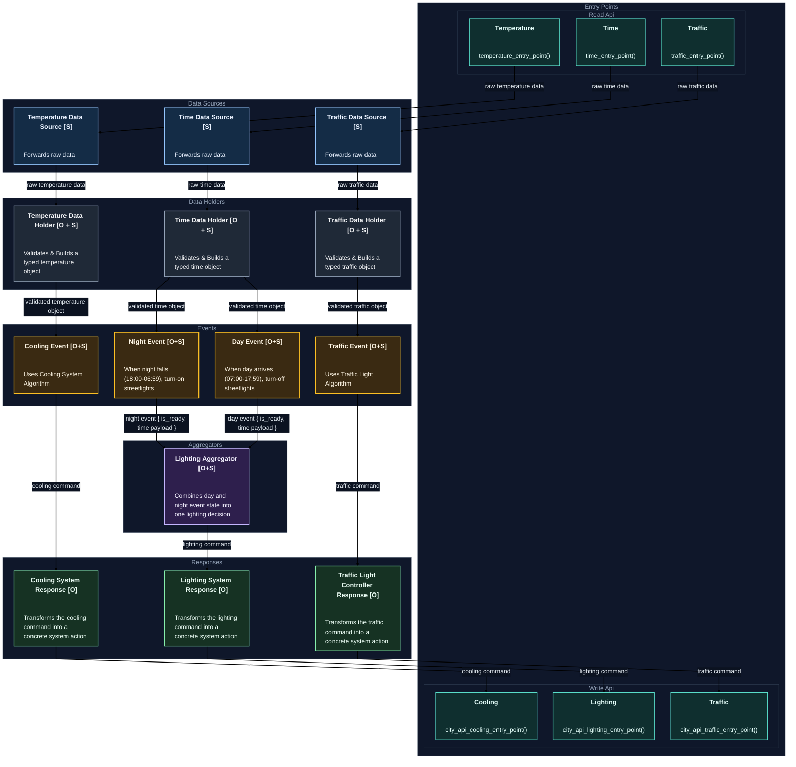

## Notation

- `[O]` = the component exposes an **Observer**
- `[S]` = the component exposes a **Subject**
- `[O + S]` = the component exposes both an **Observer** and a **Subject** 

## Design Notes

1. **Aggregator Usage**

In some parts of the system, the event could have been sent **directly to the response module** without passing through an aggregator, since there is no actual merging of multiple inputs in those cases.

However, in a project of this size, it is preferable to keep the **aggregator layer in place**.  
Although this introduces a small amount of additional code, it preserves a consistent architecture and allows the system to **scale more easily in the future** if additional inputs or decision logic are introduced.

---

2. **Data Source vs Data Holder**

In this implementation, the **Data Source** and **Data Holder** are separated into different modules.

Technically, they could have been combined into a single component.

We prefer to keep this design modular for cases where the stored information needs to maintain its own state.

In this design:

- **Data Source** is responsible for publishing and propagating information
- **Data Holder** is responsible for storing the latest state

---

3. **Aggregator "busy wait loop"**

The **Aggregator** is responsible for syncing several upstream observers before propagating the final decision to the next stage.

Aggregator must ensure that **all required inputs have completed their computation** before publishing the result.

Each upstream observer updates its own `is_ready` flag when it finishes processing.  
The Aggregator checks the state of all its dependent observers and only proceeds when **all of them are ready at the same time**.

If this condition is not satisfied, the Aggregator simply **exits the current flow** and waits for the next incoming event. When a new event arrives, the Aggregator checks the observers again to determine whether all required inputs are ready.

Because the **subjects associated with the Aggregator are global objects**, their state is accessible whenever a new event reaches the Aggregator, allowing it to evaluate whether the full set of inputs is ready.
