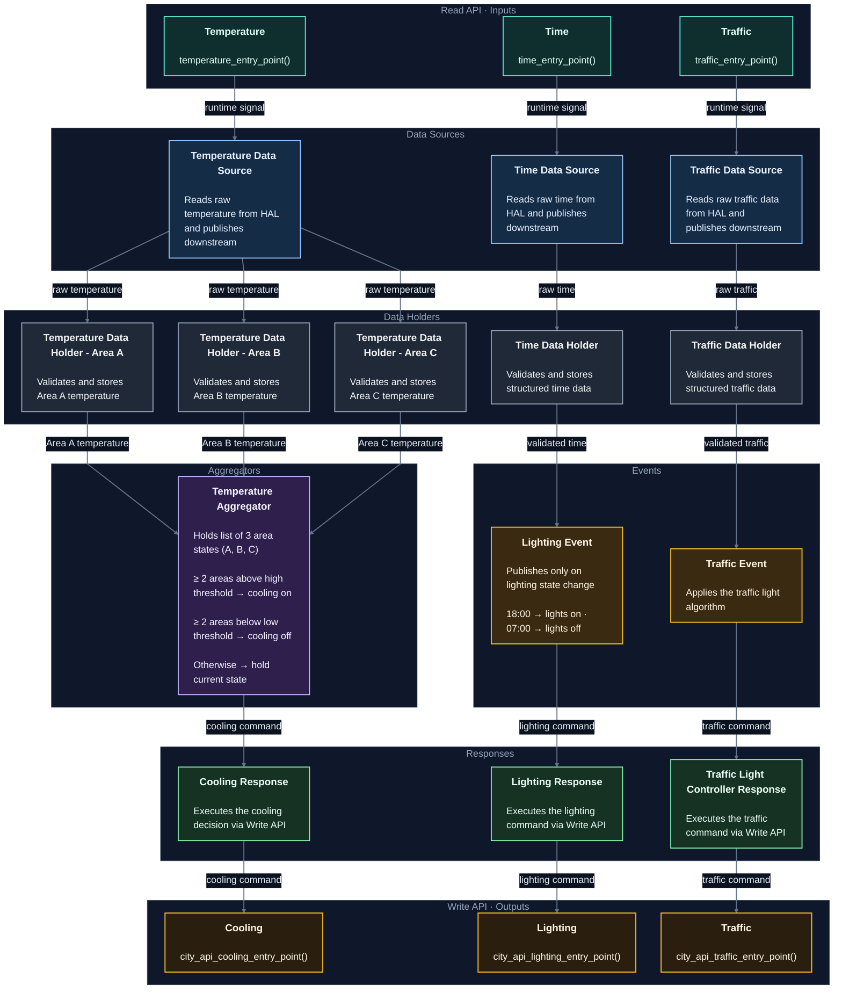

## Notation

Each component implements the Observer pattern:

| Component | Observer Pattern Role |
|-----------|----------------------|
| Read API | Trigger only - carries no data |
| Data Source | `[S]` Subject - reads from HAL, publishes raw data |
| Data Holder | `[O + S]` Observer + Subject - validates and republishes |
| Aggregator | `[O + S]` Observer + Subject - synchronizes multiple inputs |
| Event | `[O + S]` Observer + Subject - applies business logic |
| Response | `[O]` Observer - final consumer, no downstream propagation |
| Write API | Final boundary - actuates external systems |

## Design Notes

1. **Entry Points** - Forwards a runtime signal to downstream modules. Carries no data; does not read HAL.

2. **Data Sources** - Reads raw data from HAL and publishes downstream. Typically no validation.

3. **Data Holders** - Validates, parses, and stores raw data, then publishes downstream. The Temperature pipeline has 3 Data Holders (Area A, B, C).

4. **Temperature Aggregator** - Receives validated readings from Areas A, B, and C. Holds a list of 3 area states. Cooling decision:
   - ≥ 2 areas above high threshold → cooling on
   - ≥ 2 areas below low threshold → cooling off
   - otherwise → hold current state

   Publishes the cooling command directly to the Response. No Event stage.

5. **Aggregator synchronization** - Each upstream observer sets `is_ready` on completion. The Aggregator checks all flags before publishing; if any are unset, it exits and waits for the next event. After publishing, all `is_ready` flags are reset. Upstream subjects are global, so if a sensor was absent in a cycle its last value persists, bounded to at most one cycle old.

6. **Lighting Event** - Checks validated time and publishes only on state change:
   - 18:00 → lights on (transition from off)
   - 07:00 → lights off (transition from on)
   - No publish if the lighting state has not changed.

7. **Traffic Event** - Applies the traffic light algorithm and publishes the resulting command.
